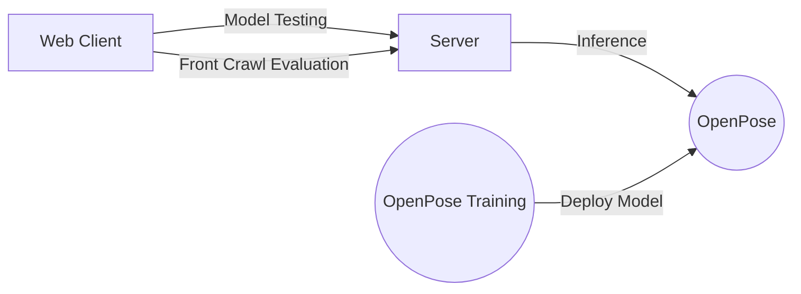

# SwimFix Pose Estimation Based System for Improving Front Crawl 
## Table of Contents
1. [Introduction](#web-interface)
2. [Features](#features)
3. [Web Client](#web-client)
4. [Inference](#inference)
5. [Training Infrastructure](#training-infrastructure)

## Introduction
This is a official git repository for the graduation project of our B.Sc. in Software Engineering in Ben Gurion University of the Negev located in Be'er Sheva, Israel.
We developed a system for improving front crawl swimming which relies on pose estimation of the swimmer.
The system takes as input a video of swimming in a front crawl setting and outputs an evaluation for the swimmer to improve upon.

## Features
- **Functionality**:
    - **2D real-time multi-person keypoint detection**:
        - 18 keypoint body keypoint estimation based on the OpenPose library.
    - **Performance evaluation** of the swimmer.
	    - Error detection
    - **Visualization** of the swimmer's pose in each frame
	    -  keypoints and angles
    - **Model Testing and Evaluation**
	    - Manual video annotation.
	    - Expected vs actual swimmer's pose.
- **Input**: Video of the swimmer in a front setting (i.e. the camera is located at the end of the pool's track and faces the swimmer as he swims towards it).
- **Output**:
	- Keypoints display (PNG, JPG, MP4) and saving (CSV).
	- Graphs of the keypoints' coordinates in each frame of the video.
	- Graphs of the angles of the swimmer's shoulder/elbows/wrists in each frame of the video.
- **OS**: Ubuntu 18.04 for inference/training, Windows 10 for inference only.
- **Training**:  Train your own model on your own data.
	- Currently we do not support deployment of the model
	- You can find a complete walk-through guide [here](https://github.com/roeegro/SwimFix/blob/master/training/README.md)
 
>TODO: put a video in here
    
## Web Client
Our client-side consists of a Flask based web client
The client allows users to upload a video of a front crawl swimming. The video is then sent to our server and receive various insights that can hopefully improve the swimmer's performance.
For detailed information and guidelines please visit [our](https://github.com/roeegro/SwimFix/blob/master/client/README.md) guide.
## Inference
Our server-side consists of a inference module based on the [OpenPose](https://github.com/CMU-Perceptual-Computing-Lab/openpose) library which estimates the swimmer's pose in every frame of the video given as input from the web client and then evaluates the swimmer's performance based on the estimation.
To install OpenPose, please check [our](https://github.com/roeegro/SwimmingProject/blob/master/server/OpenPoseSetupGuide.md) quick guide or go to the official repository linked above.
## Training Infrastructure
We created a training infrastructure for training your own custom model on your own data using the official  [OpenPose Training](https://github.com/CMU-Perceptual-Computing-Lab/openpose_train) repository.
For more information about it and a guide how to set it up and use it, please check [this](https://github.com/roeegro/SwimmingProject/blob/master/training/OpenPose%20Train%20Setup%20Guide.md) out.

> **Note:** We have also experienced with another Pose Estimation library called [OpenPose-Plus](https://github.com/tensorlayer/openpose-plus) but we do not recommend it at the moment since our inference module is using [OpenPose](https://github.com/CMU-Perceptual-Computing-Lab/openpose) which is integrated side-by-side with the above  [OpenPose Training](https://github.com/CMU-Perceptual-Computing-Lab/openpose_train) repository.

## System Architecture

<!--stackedit_data:
eyJoaXN0b3J5IjpbLTQ2NjI3MzYzMSw4OTAxMTg0MDYsLTEzNz
Q1NDkyMDBdfQ==
-->